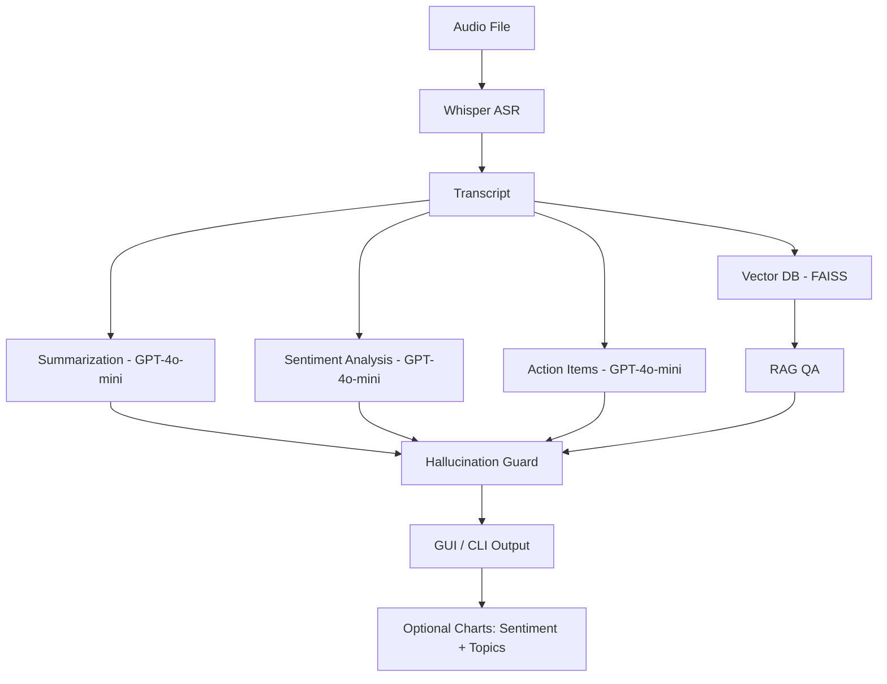

# Intellecta – ASR + NLP + RAG + Hallucination Guard Demo

**Intellecta** is a Python-based demo application that combines **Automatic Speech Recognition (ASR)**, **Natural Language Processing (NLP)**, and **Retrieval-Augmented Generation (RAG)** to process meeting audio files, extract insights, and visualize results — **with built-in hallucination detection** to ensure outputs are grounded in the transcript.

---

## 🚀 Features
- 🎙 **ASR (Speech-to-Text):** Converts audio into text using [OpenAI Whisper](https://github.com/openai/whisper).
- 📝 **Summarization:** Generates concise bullet-point summaries.
- 😊 **Sentiment Analysis:** Detects tone (Positive / Negative / Neutral).
- ✅ **Action Item Extraction:** Identifies actionable tasks.
- 📚 **RAG (Retrieval-Augmented Generation):** FAISS + LangChain for Q&A over transcripts.
- 🛡 **Hallucination Guard:**  
  - Extracts claims from summaries, action lists, and QA answers.  
  - Validates each claim against transcript via **FAISS similarity search**.  
  - Runs **LLM fact-checking** for additional verification.  
  - Assigns a **confidence score (0–1)** and flags low-confidence or unsupported claims.
- 📊 **Charts:** Optional sentiment/topic pie charts.
- 🖥 **GUI Versions:** Tkinter interfaces for easy interaction (with hallucination checks built-in).

---

## 📂 Project Structure

| File | Description |
|------|-------------|
| **main.py** | CLI version: Processes audio and prints transcript, analysis, RAG QA, and hallucination report. |
| **main_gui.py** | GUI version: File selection + analysis + hallucination report. |
| **main_gui_charts.py** | GUI + Charts version: Adds sentiment/topic charts + hallucination report. |
| **hallucination_guard.py** | Claim extraction + similarity + LLM fact-check logic. |
| **sample_audio.py** | Generates `sample_audio.wav` using macOS `say` or `pyttsx3`. |
| **requirements.txt** | Python dependencies. |
| **.env** | Stores `OPENAI_API_KEY`. |

---

## ⚙️ Installation

### 1️⃣ Clone
```bash
git clone https://github.com/yourusername/Intellecta.git
cd Intellecta
```

### 2️⃣ Create virtual environment
```bash
python3 -m venv .venv
source .venv/bin/activate
```

### 3️⃣ Install dependencies
```bash
pip install -r requirements.txt
```

**requirements.txt**
```
openai>=1.30.0
langchain
langchain-community
langchain-openai
faiss-cpu
openai-whisper
tiktoken
matplotlib
python-dotenv
pyttsx3
```

### 4️⃣ Install ffmpeg (required by Whisper)
macOS (Homebrew):
```bash
brew install ffmpeg
```
Ubuntu/Debian:
```bash
sudo apt install ffmpeg
```

---

## 🔑 API Key Setup
Create `.env` file in the project root:
```ini
OPENAI_API_KEY=your_api_key_here
```

---

## 🎙️ Generate Sample Audio
```bash
python sample_audio.py
```
- **macOS:** Uses `say` + `ffmpeg` (preferred).  
- **Others:** Falls back to `pyttsx3`.

---

## ▶️ Run
```bash
# CLI
python main.py

# GUI
python main_gui.py

# GUI + Charts
python main_gui_charts.py
```

---

## 🛡 Hallucination Guard – How it Works
1. **Extract Claims:**  
   - From summaries, action items, and RAG QA answers.
2. **Vector Similarity Check (FAISS):**  
   - Finds top transcript passages for each claim.
3. **LLM Fact-Check:**  
   - Asks GPT if the claim is supported by the retrieved passages.
4. **Confidence Scoring:**  
   - Combines similarity + LLM confidence.
5. **Flagging:**  
   - Marks unsupported or low-confidence claims in output.

**Example CLI Output:**
```
=== Hallucination Check: Summary ===
[1] CLAIM: We will prepare the pricing proposal by Friday.
  - similarity_ok: True (scores=[0.89, 0.76])
  - llm_grounded: True (conf=0.95)
  - overall_confidence: 0.92 ✅
  - support: The meeting included a note about preparing pricing proposal by Friday.
  - reason: Directly stated in transcript.
```

---

## 🛠 Tech Stack
- Python 3.9+
- Whisper (ASR)
- OpenAI GPT-4o-mini (NLP)
- LangChain + FAISS (RAG)
- Matplotlib (Charts)
- dotenv (Environment Variables)
- ffmpeg (Audio processing)

---

## 📌 Workflow


---

## 📜 License
MIT License. See LICENSE for details.
